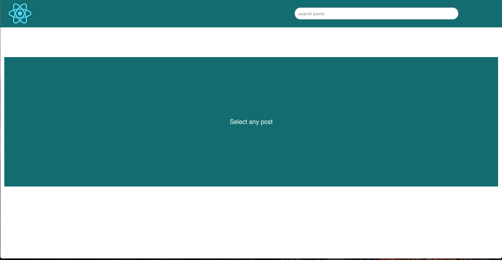

## Autocomplete App 

This Application includes a built-in prediction service what you're typing in search bar, made with React. 
View the [demo](https://searchpost.netlify.com/)

## Built With

* ES6
* React.js
* Redux
* Axios.js

## Main Files

* [App](src/App.js)
    * [Search-posts](src/container/Search-posts.js)
    * [UserInfo](src/components/UserInfo)
* [Configuration](src/index.js)
* [Store](src/store)

## info
Fetching data from local json file. If we want to get the data from server just change baseURl in axiosInstance js file [src/axiosInstance.js](src/axiosInstance.js)
we can also use React.lazy for implement on-demand request

This project was bootstrapped with [Create React App](https://github.com/facebook/create-react-app).

## Available Scripts

In the project directory, you can run:

### `npm start`

Runs the app in the development mode. 
Open [http://localhost:3000](http://localhost:3000) to view it in the browser.

The page will reload if you make edits. 
You will also see any lint errors in the console.

### `npm test`

Launches the test runner in the interactive watch mode. 
See the section about [running tests](https://facebook.github.io/create-react-app/docs/running-tests) for more information.

### `npm run build`

Builds the app for production to the `build` folder. 
It correctly bundles React in production mode and optimizes the build for the best performance.

The build is minified and the filenames include the hashes. 
Your app is ready to be deployed!

See the section about [deployment](https://facebook.github.io/create-react-app/docs/deployment) for more information.
